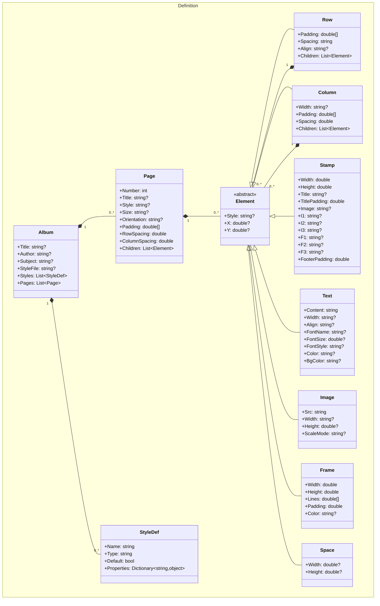
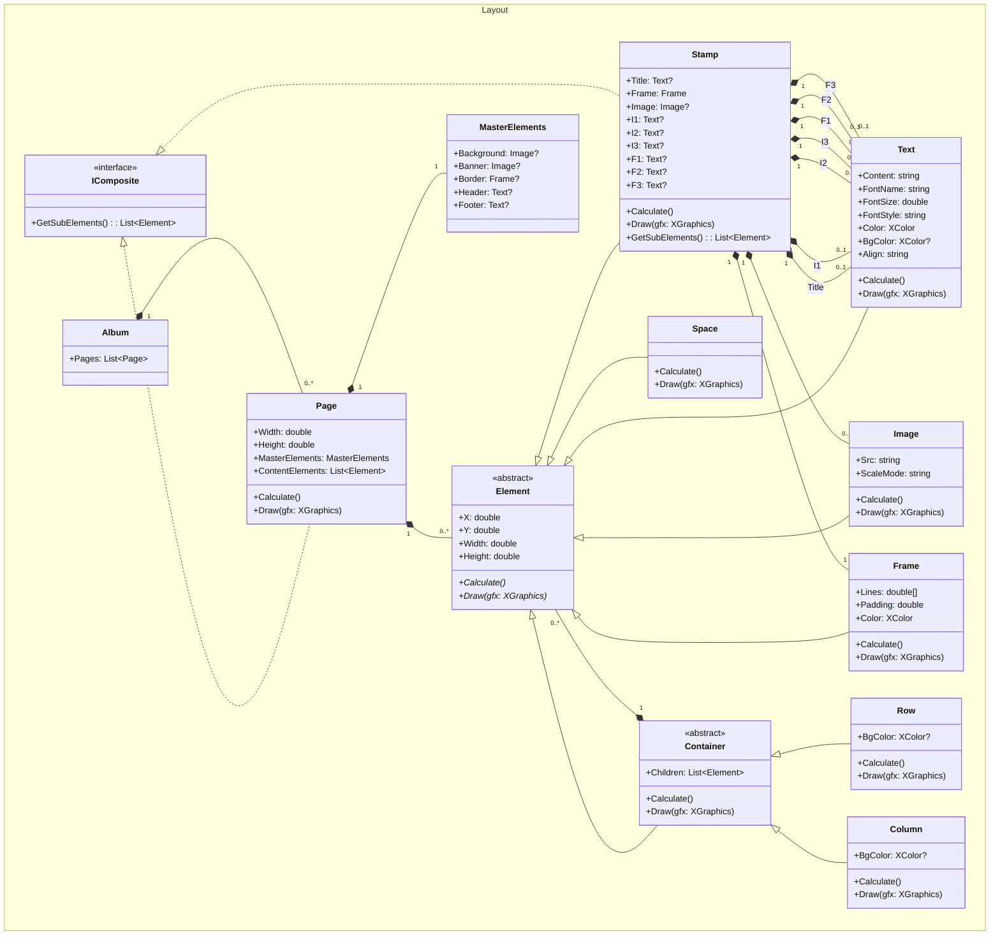
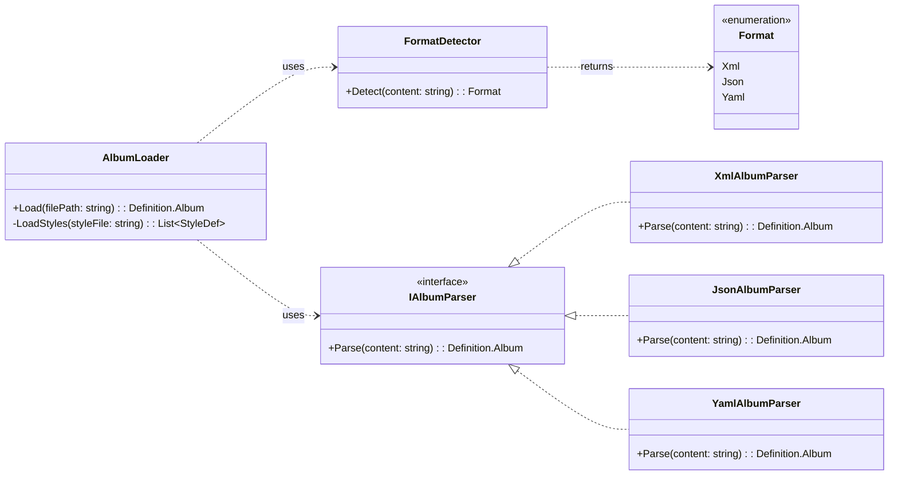
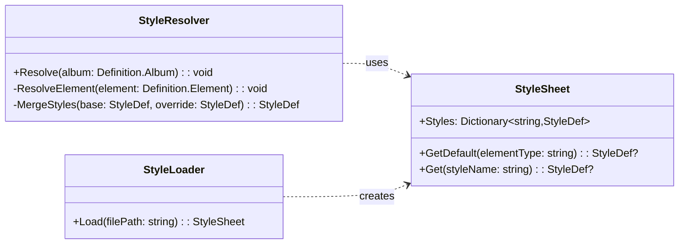
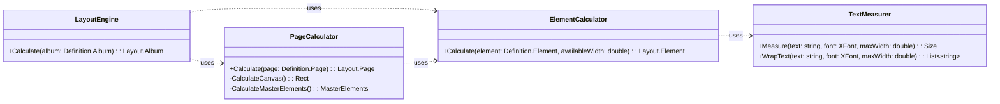
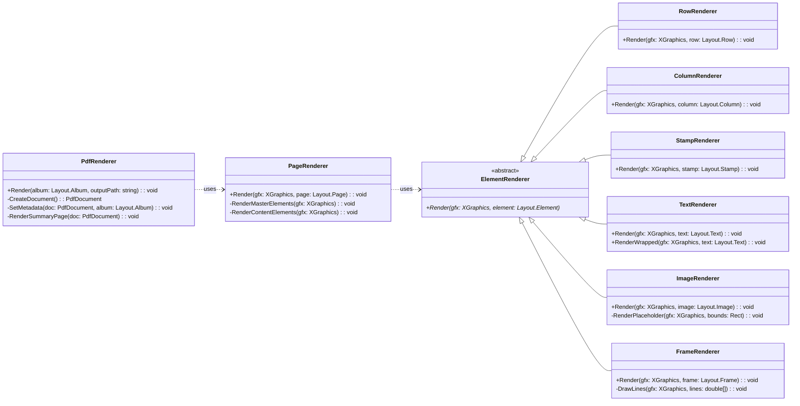
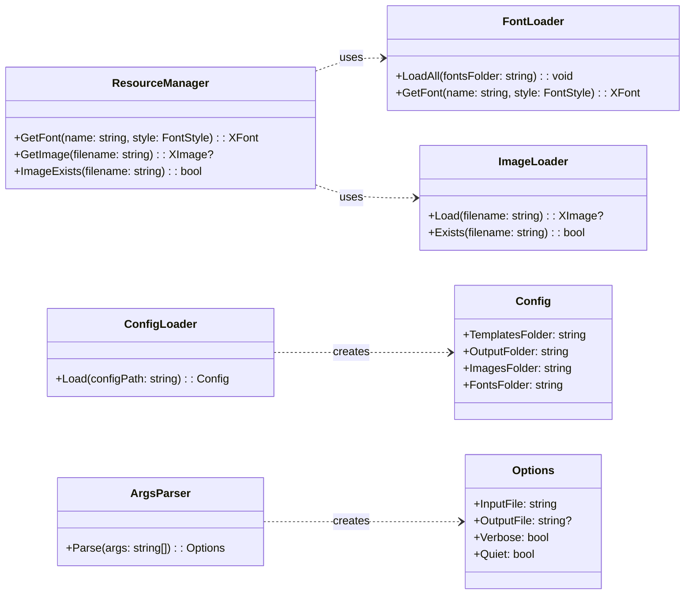

# MyAlbum v7.0 Class Diagram

## Overview

Class diagram for MyAlbum v7.0 based on the architecture design. Shows two model namespaces (Definition and Layout), parsing, style resolution, layout calculation, and rendering.

---

## 1. Definition Model (Parsed)

---

## 2. Layout Model (Computed)

---

## 3. Parsing Layer

---

## 4. Style Resolution

---

## 5. Layout Engine

---

## 6. Rendering Pipeline

---

## 7. Resources & Startup

---

## 8. Class Summary

### Definition Namespace (Parsed Model)

| Class | Type | Description |
|-------|------|-------------|
| `Album` | Model | Root container with metadata and pages |
| `StyleDef` | Model | Style definition with properties |
| `Page` | Model | Page definition with children |
| `Element` | Abstract | Base for all elements |
| `Row` | Container | Horizontal layout |
| `Column` | Container | Vertical layout |
| `Stamp` | Composite | Stamp with title, frame, interior, footer |
| `Text` | Leaf | Text content |
| `Image` | Leaf | Image reference |
| `Frame` | Leaf | Border/frame |
| `Space` | Leaf | Empty space |

### Layout Namespace (Computed Model)

| Class | Type | Description |
|-------|------|-------------|
| `Album` | Model | Computed album with pages |
| `Page` | Container + Composite | Computed page with master and content |
| `MasterElements` | Model | Page master elements (banner, border, etc.) |
| `Element` | Abstract | Base with X, Y, Width, Height, Calculate(), Draw() |
| `Container` | Abstract | Base for Row, Column with children |
| `IComposite` | Interface | For elements with fixed sub-elements |
| `Row` | Container | Computed row |
| `Column` | Container | Computed column |
| `Stamp` | Composite | Computed stamp with sub-elements |
| `Text` | Leaf | Computed text |
| `Image` | Leaf | Computed image |
| `Frame` | Leaf | Computed frame |
| `Space` | Leaf | Computed space |

### Other Layers

| Layer | Key Classes |
|-------|-------------|
| **Parsing** | AlbumLoader, FormatDetector, IAlbumParser, XmlAlbumParser, JsonAlbumParser, YamlAlbumParser |
| **Styles** | StyleResolver, StyleSheet, StyleLoader |
| **Layout** | LayoutEngine, PageCalculator, ElementCalculator, TextMeasurer |
| **Rendering** | PdfRenderer, PageRenderer, ElementRenderer (Row, Column, Stamp, Text, Image, Frame) |
| **Resources** | ResourceManager, FontLoader, ImageLoader |
| **Startup** | ConfigLoader, ArgsParser |

---

## 9. Key Relationships

1. **Definition.Element hierarchy**: Element (abstract) → Row, Column, Stamp, Text, Image, Frame, Space
2. **Layout.Element hierarchy**: Element (abstract) → Container (abstract) → Row, Column; Element → Text, Image, Frame, Space, Stamp
3. **IComposite implementers**: Layout.Stamp, Layout.Page
4. **Parser pattern**: AlbumLoader uses FormatDetector to select IAlbumParser implementation
5. **Two-pass processing**: StyleResolver (pass 1) → LayoutEngine (pass 2)
6. **Rendering delegation**: PdfRenderer → PageRenderer → ElementRenderer subclasses
