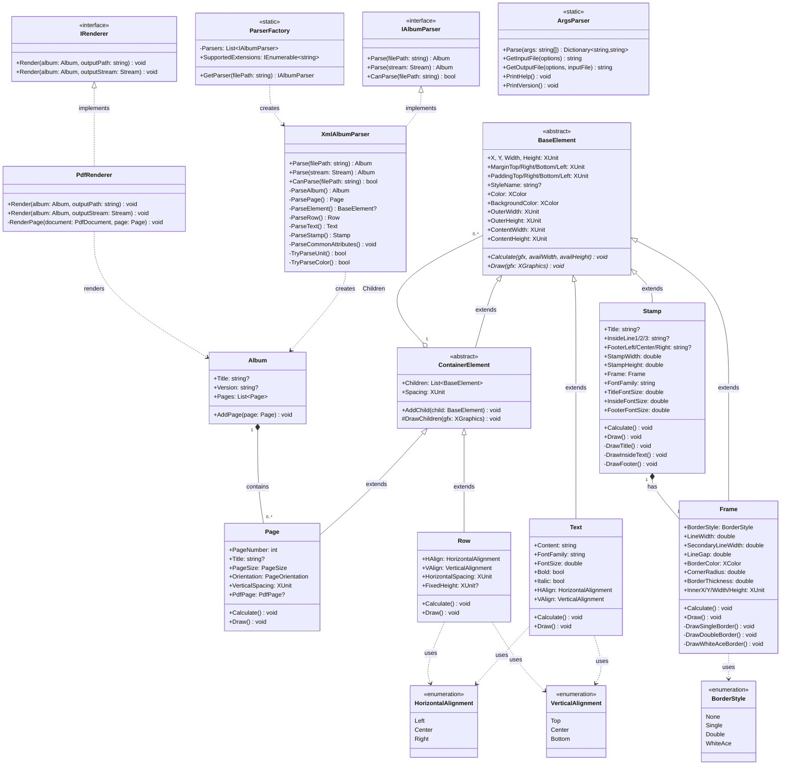

# MyAlbum v7.0 Class Diagram

## Overview

This document contains the class diagram for the current implementation of MyAlbum v7.0 after completing Phase 1 (Foundation) and Phase 2 (Stamp Support).

---

## Class Diagram

---

## Class Summary

### Models Layer

| Class | Type | Description |
|-------|------|-------------|
| `Album` | Model | Root container holding pages and metadata |
| `BaseElement` | Abstract | Base class for all renderable elements |
| `ContainerElement` | Abstract | Base for elements that contain children |
| `Page` | Container | Represents a single album page |
| `Row` | Container | Horizontal layout of child elements |
| `Text` | Leaf | Text content with font styling |
| `Frame` | Leaf | Border/frame with multiple styles |
| `Stamp` | Composite | Philatelic stamp with title, frame, text, footer |

### Parsing Layer

| Class | Type | Description |
|-------|------|-------------|
| `IAlbumParser` | Interface | Contract for album file parsers |
| `ParserFactory` | Static | Selects appropriate parser by file extension |
| `XmlAlbumParser` | Implementation | Parses XML/album files |

### Rendering Layer

| Class | Type | Description |
|-------|------|-------------|
| `IRenderer` | Interface | Contract for output renderers |
| `PdfRenderer` | Implementation | Generates PDF using PdfSharpCore |

### Utilities Layer

| Class | Type | Description |
|-------|------|-------------|
| `ArgsParser` | Static | CLI argument parsing |

---

## Key Relationships

1. **Inheritance Chain**: `BaseElement` → `ContainerElement` → `Page` / `Row`
2. **Inheritance Chain**: `BaseElement` → `Text`, `Frame`, `Stamp`
3. **Composition**: `Album` contains `Page` list
4. **Composition**: `Stamp` contains `Frame`
5. **Aggregation**: `ContainerElement` holds `BaseElement` children
6. **Implementation**: `XmlAlbumParser` implements `IAlbumParser`
7. **Implementation**: `PdfRenderer` implements `IRenderer`
